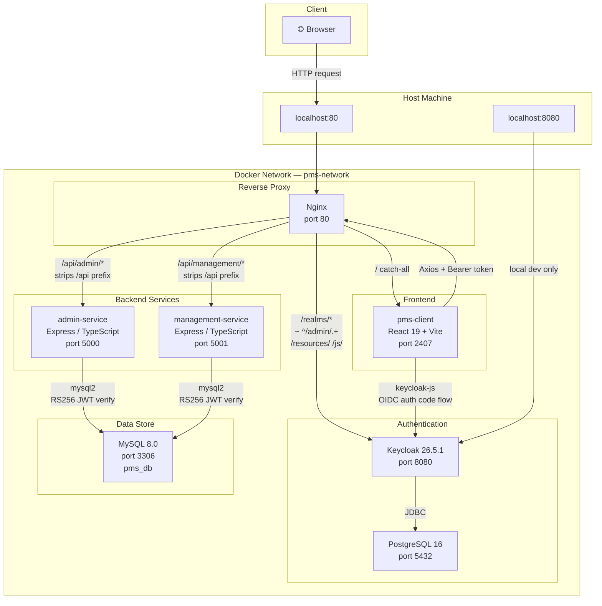
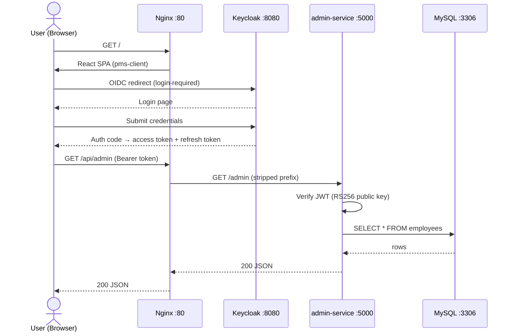
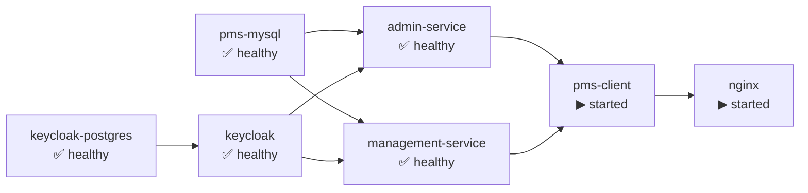
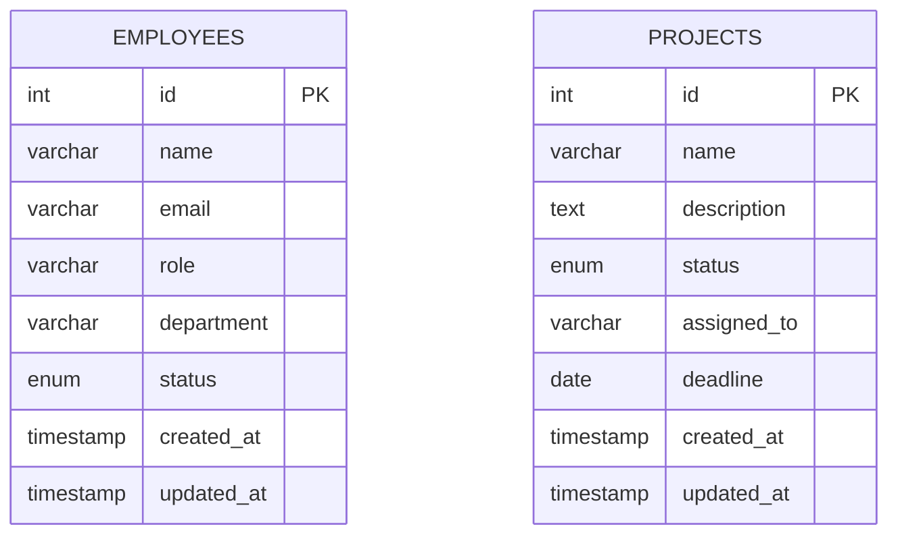
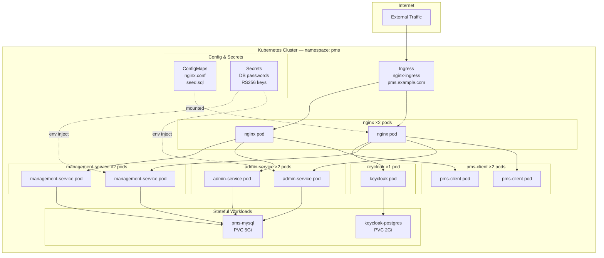

# PMS Microservices — Architecture Diagram

## System Architecture

```mermaid
graph TB
    subgraph CLIENT["Client"]
        B["🌐 Browser"]
    end

    subgraph DOCKER["Docker Network — pms-network"]
        direction TB

        subgraph PROXY["Reverse Proxy"]
            NG["Nginx\nport 80"]
        end

        subgraph AUTH["Authentication"]
            KC["Keycloak 26.5.1\nport 8080"]
            PG["PostgreSQL 16\nport 5432"]
        end

        subgraph SERVICES["Backend Services"]
            AS["admin-service\nExpress / TypeScript\nport 5000"]
            MS["management-service\nExpress / TypeScript\nport 5001"]
        end

        subgraph DATA["Data Store"]
            MY["MySQL 8.0\nport 3306\npms_db"]
        end

        subgraph FRONTEND["Frontend"]
            PC["pms-client\nReact 19 + Vite\nport 2407"]
        end
    end

    subgraph HOST["Host Machine"]
        P80["localhost:80"]
        P8080["localhost:8080"]
    end

    B -->|"HTTP request"| P80
    P80 --> NG
    P8080 -->|"local dev only"| KC

    NG -->|"/api/admin/*\nstrips /api prefix"| AS
    NG -->|"/api/management/*\nstrips /api prefix"| MS
    NG -->|"/realms/*\n~ ^/admin/.+\n/resources/ /js/"| KC
    NG -->|"/ catch-all"| PC

    KC -->|"JDBC"| PG

    AS -->|"mysql2\nRS256 JWT verify"| MY
    MS -->|"mysql2\nRS256 JWT verify"| MY

    PC -->|"keycloak-js\nOIDC auth code flow"| KC
    PC -->|"Axios + Bearer token"| NG
```

---

## Request Flow

```mermaid
sequenceDiagram
    actor User as User (Browser)
    participant NG as Nginx :80
    participant KC as Keycloak :8080
    participant AS as admin-service :5000
    participant MY as MySQL :3306

    User->>NG: GET /
    NG->>User: React SPA (pms-client)

    User->>KC: OIDC redirect (login-required)
    KC-->>User: Login page
    User->>KC: Submit credentials
    KC-->>User: Auth code → access token + refresh token

    User->>NG: GET /api/admin (Bearer token)
    NG->>AS: GET /admin (stripped prefix)
    AS->>AS: Verify JWT (RS256 public key)
    AS->>MY: SELECT * FROM employees
    MY-->>AS: rows
    AS-->>NG: 200 JSON
    NG-->>User: 200 JSON
```

---

## Docker Compose Startup Order

```mermaid
graph LR
    PG["keycloak-postgres\n✅ healthy"] --> KC["keycloak\n✅ healthy"]
    MYSQL["pms-mysql\n✅ healthy"] --> AS["admin-service\n✅ healthy"]
    MYSQL --> MS["management-service\n✅ healthy"]
    KC --> AS
    KC --> MS
    AS --> PC["pms-client\n▶ started"]
    MS --> PC
    PC --> NG["nginx\n▶ started"]
```

---

## Data Model

```mermaid
erDiagram
    EMPLOYEES {
        int id PK
        varchar name
        varchar email
        varchar role
        varchar department
        enum status
        timestamp created_at
        timestamp updated_at
    }

    PROJECTS {
        int id PK
        varchar name
        text description
        enum status
        varchar assigned_to
        date deadline
        timestamp created_at
        timestamp updated_at
    }
```

---

## Kubernetes Deployment

```mermaid
graph TB
    subgraph INTERNET["Internet"]
        EXT["External Traffic"]
    end

    subgraph K8S["Kubernetes Cluster — namespace: pms"]
        direction TB

        ING["Ingress\nnginx-ingress\npms.example.com"]

        subgraph NGINX_DEP["nginx  ×2 pods"]
            NG1["nginx pod"]
            NG2["nginx pod"]
        end

        subgraph FRONT_DEP["pms-client  ×2 pods"]
            PC1["pms-client pod"]
            PC2["pms-client pod"]
        end

        subgraph ADMIN_DEP["admin-service  ×2 pods"]
            AS1["admin-service pod"]
            AS2["admin-service pod"]
        end

        subgraph MGMT_DEP["management-service  ×2 pods"]
            MS1["management-service pod"]
            MS2["management-service pod"]
        end

        subgraph KC_DEP["keycloak  ×1 pod"]
            KC1["keycloak pod"]
        end

        subgraph DB["Stateful Workloads"]
            MYSQL["pms-mysql\nPVC 5Gi"]
            PGDB["keycloak-postgres\nPVC 2Gi"]
        end

        subgraph CFGS["Config & Secrets"]
            CM["ConfigMaps\nnginx.conf\nseed.sql"]
            SEC["Secrets\nDB passwords\nRS256 keys"]
        end
    end

    EXT --> ING
    ING --> NG1
    ING --> NG2
    NG1 --> PC1
    NG2 --> PC2
    NG1 --> AS1
    NG2 --> AS2
    NG1 --> MS1
    NG2 --> MS2
    NG1 --> KC1
    AS1 --> MYSQL
    AS2 --> MYSQL
    MS1 --> MYSQL
    MS2 --> MYSQL
    KC1 --> PGDB
    CM -.->|mounted| NG1
    SEC -.->|env inject| AS1
    SEC -.->|env inject| MS1
```
